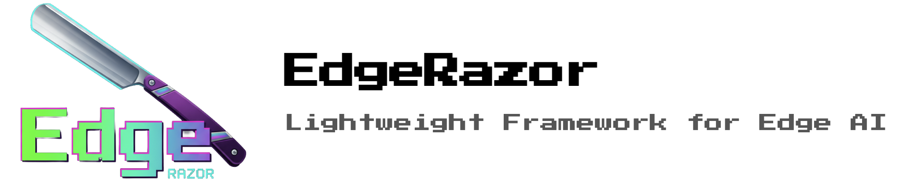

EdgeRazor is a unified lightweight framework for edge AI, designed to make models lighter, faster, and deployable across diverse scenarios. It seamlessly integrates mainstream lightweight techniques into your existing full-precision training pipeline with minimal code modification. Whether you're targeting mobile devices, embedded systems, resource-constrained edge deployments, or compute-intensive cloud services, EdgeRazor empowers you to compress state-of-the-art models without sacrificing unacceptable performance.

**Table of Contents**

- [News](#news)
- [Getting Started](#getting-started)
  - [Installation](#installation)
  - [Usage](#usage)
- [Features](#features)
- [Example](#example)
- [Reference](#reference)
- [Contributors](#contributors)

## News

- [2026/01] 🔥 EdgeRazor V1 is released!
- [2025/10] 📝 TernaryCLIP is released! Check our paper [here](https://arxiv.org/abs/2510.21879).

## Getting Started

### Installation

```
git clone https://github.com/zhangsq-nju/EdgeRazor.git && cd EdgeRazor
conda create -n edgerazor python=3.10 -y
conda activate edgerazor
pip install -e .[cu128]
```

### Usage

1. Use unified configuration by [yaml](./example/configs/qad/qat_w4_a8_kd_fd.yaml), [json](./example/configs/qad/qat_w4_a8_kd_fd.json) or [dict](./example/configs/qad/qat_w4_a8_kd_fd.py).

2. Seamlessly integrate EdgeRazor into your FULL-PRECISION model training and enjoy your lightweight journey!

```python
# Init EdgeRazor for lightweight model
edgerazor = EdgeRazor(config="/path/to/config.yaml")
student = edgerazor.quantize(student)
# Training loop
student_outputs = student(inputs)
teacher_outputs = teacher(inputs)
# Calculate loss
loss, loss_dict = edgerazor.compute_loss(student_outputs, teacher_outputs, labels)
```

## Features

- Quantization-Aware Training, QAT 🔢
- Knowledge Distillation, KD ⚗️
- Quantization-Aware Distillation, QAD 💎
- Pruning ✂️ (Work in Progress)

## Example

- Lightweight ViT-S/16 on MNIST, check [here](./example/vit/README.md).
- Lightweight ResNet-18 on MNIST, check [here](./example/resnet/README.md).

## Reference

❤️ If you find our code/paper useful or relevant to your research and work, please kindly cite our paper:

```
@article{zhangsh-ternaryclip,
  title={{TernaryCLIP}: Efficiently Compressing Vision-Language Models with Ternary Weights and Distilled Knowledge}, 
  author={Shu-Hao Zhang and Wei-Cheng Tang and Chen Wu and Peng Hu and Nan Li and Liang-Jie Zhang and Qi Zhang and Shao-Qun Zhang},
  year={2025},
  journal={arXiv preprint arXiv:2510.21879}
}
```

## Contributors

- Shu-Hao Zhang: Core developer and maintainer of EdgeRazor-V1.