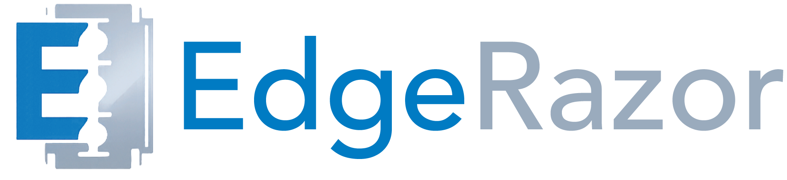
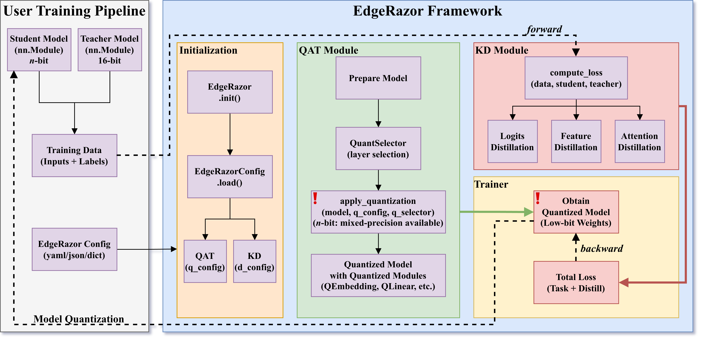

<div align="center">
  <br/>
  
  <h3>
    Lightweight Framework for Edge AI
  </h3>

  <p>
    <!-- <a href="https://arxiv.org/abs/2604.xxxxx" target="blank">
      
    </a> -->
    <a href="https://huggingface.co/collections/zhangsq-nju/edgerazor-nbit" target="blank">
      
    </a>
    <a href="./README_ZH.md">
      
    </a>
    <a href="https://github.com/zhangsq-nju/EdgeRazor/blob/main/LICENSE">
      
    </a>
  </p>

  <h5>
    ✨ If you like our project, please give us a star ⭐️ for the latest update.
  </h5>
</div>

**EdgeRazor** is a unified and lightweight framework for edge AI, designed to train models that are smaller, faster, and deployable across diverse hardware, ranging from mobile and edge endpoints to latency-sensitive clouds. The EdgeRazor framework **seamlessly integrates** model compression techniques into existing full-precision training pipelines with **minimal code modification**, preserving promising task performance and enabling low-cost and high-efficiency computations.

EdgeRazor currently focuses on low-bit LLM compression via configurable quantization-aware distillation. In terms of **quantization**, EdgeRazor supports quantizing weights (including embedding and lm_head layers), activations, and KV cache. Quantized bit-widths include the uniform 1.58-bit and 4-bit, as well as matrix-wise mixed-precision, such as 2.79-bit (50% 4-bit + 50% 1.58-bit) and 1.88-bit (12.5% 4-bit + 87.5% 1.58-bit). In terms of **distillation**, EdgeRazor offers the logits, features, and attention distillation, all of which can be flexibly combined within a unified configuration interface.

EdgeRazor achieves the state-of-the-art performance across a range of models, including base LLMs, instruction-tuned LLMs, and multimodal LLMs. For W-A8-KV8 quantization, **Qwen3-0.6B-EdgeRazor** attains average scores of **47.80** / **44.10** / **41.76** / **39.81** at 4-bit / 2.79-bit / 1.88-bit / 1.58-bit, corresponding to compression ratios of **3.94×** / **5.05×** / **6.40×** / **7.03×**, respectively. In comparison, the best prior methods achieve <u>45.74</u> / <u>37.38</u> / <u>30.49</u> at 4-bit / 3-bit / 2-bit with compression ratios of <u>2.21×</u> / <u>2.47×</u> / <u>2.78×</u>.

<p align="center">
  
  <br> Figure: The EdgeRazor framework with lightweight model training pipeline.
</p>

## News

- 🔥 **[2026-04]**: 🏆 Low-bit LLMs by EdgeRazor is released! Check our Hugging Face collection: [zhangsq-nju/edgerazor-nbit](https://huggingface.co/collections/zhangsq-nju/edgerazor-nbit).
- 🔥 **[2026-04]**: 🛠️ Open-sourced EdgeRazor-V1 is released! Now configurable on diverse models for seamless integration and customization!
- 🔥 **[2025-10]**: 📄 Paper-TernaryCLIP is available on arXiv: [2510.21879](https://arxiv.org/abs/2510.21879)!
<!-- - 🔥 **[2026-04]**: 📄 Paper-EdgeRazor is available on arXiv: [2604.xxxxx](https://arxiv.org/abs/2604.xxxxx)! -->

## Contents

- [News](#news)
- [Contents](#contents)
- [Getting Started](#getting-started)
  - [Installation](#installation)
  - [Usage](#usage)
- [Main Techniques](#main-techniques)
- [Applications](#applications)
- [Model Zoo](#model-zoo)
  - [LLMs](#llms)
  - [MLLMs](#mllms)
- [Citation](#citation)
- [Contributor List](#contributor-list)

## Getting Started

### Installation

- Download from GitHub (latest version)

```
git clone https://github.com/zhangsq-nju/EdgeRazor.git && cd EdgeRazor
conda create -n edgerazor python=3.10.20 -y
conda activate edgerazor
pip install -e .[cu128]
```

### Usage

1. Use unified configuration by [yaml](./example/configs/qad/qat_w4_a8_kd_fd.yaml), [json](./example/configs/qad/qat_w4_a8_kd_fd.json) or [dict](./example/configs/qad/qat_w4_a8_kd_fd.py).

2. Seamlessly integrate EdgeRazor into your FULL-PRECISION model training and enjoy your lightweight journey!

```python
# Init EdgeRazor for lightweight model
edgerazor = EdgeRazor(config="/path/to/config.yaml")
student = edgerazor.quantize(student)
# Training loop
student_outputs = student(inputs)
teacher_outputs = teacher(inputs)
# Calculate loss
loss, loss_dict = edgerazor.compute_loss(student_outputs, teacher_outputs, labels)
```

## Main Techniques

Quantization-Aware Distillation (QAD): 

- Configurable mixed-precision quantization for weights
- Configurable knowledge distillation pipelines between 16-bit and $n$-bit models
- Knowledge distillation methods: Adaptive Feature Distillation (AFD), Entropy-Aware KL Divergence (EAKLD)

## Applications

- Lightweight ViT-S/16, check [here](./example/vit/README.md).
- Lightweight ResNet-18, check [here](./example/resnet/README.md).
- Lightweight Qwen3-0.6B/1.7B, coming soon.
- Lightweight MobileLLM-ParetoQ-350M-BF16, coming soon.
- Lightweight Qwen2.5-Omni-7B, coming soon.
<!-- - Lightweight Qwen3-0.6B/1.7B, check [here](./example/qwen3/README.md).
- Lightweight MobileLLM-ParetoQ-350M-BF16, check [here](./example/mobilellm/README.md).
- Lightweight Qwen2.5-Omni-7B, check [here](./example/qwen2_5-omni/README.md). -->

## Model Zoo

### LLMs

- Average Performance (Avg.): average of performance scores in multiple tasks using [lm-eval v0.4.9.1](https://github.com/EleutherAI/lm-evaluation-harness/tree/v0.4.9.1) with [tasks](./src/eval/tasks/lm_eval/).
  - Tasks for instruct LLMs: arc_easy, arc_challenge, hellaswag, boolq, social_iqa, openbookqa, piqa, winogrande, truthfulqa_mc2, hendrycks_ethics, mmlu, gsm8k, humaneval_instruct, ifeval.
  - Tasks for base LLMs: arc_easy, arc_challenge, hellaswag, boolq, social_iqa, openbookqa, piqa, winogrande, truthfulqa_mc2, hendrycks_ethics, mmlu, gsm8k, humaneval.
  - Except for 5-shot gsm8k, all other tasks are 0-shot.

- Hub Link: We provide the original quantized checkpoints. We also transfer the checkpoints into GGUF ([llama.cpp](https://github.com/ggml-org/llama.cpp)) and GPTQ ([GPTQModel](https://github.com/ModelCloud/GPTQModel), working in progress) formats if compatible.

| Model          | W-A-KV       | Group Size | Avg.  | Hub Link                                                                                                                                                                                                                                                                                                                       |
| -------------- | ------------ | ---------- | ----- | ------------------------------------------------------------------------------------------------------------------------------------------------------------------------------------------------------------------------------------------------------------------------------------------------------------------------------ |
| Qwen3-0.6B     | W16-A16-KV16 | -          | 47.35 | [Base](https://huggingface.co/Qwen/Qwen3-0.6B)                                                                                                                                                                                                                                                                                 |
| Qwen3-0.6B     | W4-A8-KV8    | 256        | 47.80 | [EdgeRazor](https://huggingface.co/zhangsq-nju/Qwen3-0.6B-EdgeRazor-4bit), [Q4_0.gguf](https://huggingface.co/zhangsq-nju/Qwen3-0.6B-EdgeRazor-GGUF/resolve/main/Qwen3-0.6B-EdgeRazor-Q4_0.gguf)                                                                                                                               |
| Qwen3-0.6B     | W2.79-A8-KV8 | 256        | 44.10 | [EdgeRazor](https://huggingface.co/zhangsq-nju/Qwen3-0.6B-EdgeRazor-2.79bit)                                                                                                                                                                                                                                                   |
| Qwen3-0.6B     | W1.88-A8-KV8 | 256        | 41.76 | [EdgeRazor](https://huggingface.co/zhangsq-nju/Qwen3-0.6B-EdgeRazor-1.88bit)                                                                                                                                                                                                                                                   |
| Qwen3-0.6B     | W1.58-A8-KV8 | 256        | 39.81 | [EdgeRazor](https://huggingface.co/zhangsq-nju/Qwen3-0.6B-EdgeRazor-1.58bit), [TQ1_0.gguf](https://huggingface.co/zhangsq-nju/Qwen3-0.6B-EdgeRazor-GGUF/resolve/main/Qwen3-0.6B-EdgeRazor-TQ1_0.gguf), [TQ2_0.gguf](https://huggingface.co/zhangsq-nju/Qwen3-0.6B-EdgeRazor-GGUF/resolve/main/Qwen3-0.6B-EdgeRazor-TQ2_0.gguf) |
| Qwen3-1.7B     | W16-A16-KV16 | -          | 58.65 | [Base](https://huggingface.co/Qwen/Qwen3-1.7B)                                                                                                                                                                                                                                                                                 |
| Qwen3-1.7B     | W4-A8-KV8    | 256        | 58.57 | [EdgeRazor](https://huggingface.co/zhangsq-nju/Qwen3-1.7B-EdgeRazor-4bit), [Q4_0.gguf](https://huggingface.co/zhangsq-nju/Qwen3-1.7B-EdgeRazor-GGUF/resolve/main/Qwen3-1.7B-EdgeRazor-Q4_0.gguf)                                                                                                                               |
| Qwen3-1.7B     | W2.79-A8-KV8 | 256        | 53.00 | [EdgeRazor](https://huggingface.co/zhangsq-nju/Qwen3-1.7B-EdgeRazor-2.79bit)                                                                                                                                                                                                                                                   |
| Qwen3-1.7B     | W1.88-A8-KV8 | 256        | 47.14 | [EdgeRazor](https://huggingface.co/zhangsq-nju/Qwen3-1.7B-EdgeRazor-1.88bit)                                                                                                                                                                                                                                                   |
| Qwen3-1.7B     | W1.58-A8-KV8 | 256        | 43.91 | [EdgeRazor](https://huggingface.co/zhangsq-nju/Qwen3-1.7B-EdgeRazor-1.58bit), [TQ1_0.gguf](https://huggingface.co/zhangsq-nju/Qwen3-1.7B-EdgeRazor-GGUF/resolve/main/Qwen3-1.7B-EdgeRazor-TQ1_0.gguf), [TQ2_0.gguf](https://huggingface.co/zhangsq-nju/Qwen3-1.7B-EdgeRazor-GGUF/resolve/main/Qwen3-1.7B-EdgeRazor-TQ2_0.gguf) |
| MobileLLM-350M | W16-A16-KV16 | -          | 41.18 | [Base](https://huggingface.co/facebook/MobileLLM-ParetoQ-350M-BF16)                                                                                                                                                                                                                                                            |
| MobileLLM-350M | W4-A8-KV8    | 64         | 41.86 | [EdgeRazor](https://huggingface.co/zhangsq-nju/MobileLLM-350M-EdgeRazor-4bit)                                                                                                                                                                                                                                                  |
| MobileLLM-350M | W2.79-A8-KV8 | 64         | 40.62 | [EdgeRazor](https://huggingface.co/zhangsq-nju/MobileLLM-350M-EdgeRazor-2.79bit)                                                                                                                                                                                                                                               |
| MobileLLM-350M | W1.88-A8-KV8 | 64         | 39.02 | [EdgeRazor](https://huggingface.co/zhangsq-nju/MobileLLM-350M-EdgeRazor-1.88bit)                                                                                                                                                                                                                                               |
| MobileLLM-350M | W1.58-A8-KV8 | 64         | 38.12 | [EdgeRazor](https://huggingface.co/zhangsq-nju/MobileLLM-350M-EdgeRazor-1.58bit)                                                                                                                                                                                                                                               |

### MLLMs

- Video-MME and MLVU are video understanding tasks using [lmms-eval v0.5.0](https://github.com/EvolvingLMMs-Lab/lmms-eval/tree/v0.5) with [tasks](./src/eval/tasks/lmms-eval/).

| Model           | W-A-KV       | Group Size | Video-MME | MLVU  | Hub Link                                                                       |
| --------------- | ------------ | ---------- | --------- | ----- | ------------------------------------------------------------------------------ |
| Qwen2.5-Omni-7B | W16-A16-KV16 | -          | 62.81     | 48.01 | [Base](https://huggingface.co/Qwen/Qwen2.5-Omni-7B)                            |
| Qwen2.5-Omni-7B | W4-A16-KV16  | 32         | 62.22     | 48.82 | [EdgeRazor](https://huggingface.co/zhangsq-nju/Qwen2.5-Omni-7B-EdgeRazor-4bit) |

## Citation

If you find our papar and code useful in your research, please consider kindly citing our papers ✏️:

```
@article{zhangsh-edgerazor,
  title={{EdgeRazor}: A Lightweight Framework for Large Language Models via Mixed-Precision Quantization-Aware Distillation},
  author={Shu-Hao Zhang and Le-Tong Huang and Xiang-Sheng Deng and Xin-Yi Zou and Chen Wu and Nan Li and Shao-Qun Zhang},
  year={2026},
}

@article{zhangsh-ternaryclip,
  title={{TernaryCLIP}: Efficiently Compressing Vision-Language Models with Ternary Weights and Distilled Knowledge},
  author={Shu-Hao Zhang and Wei-Cheng Tang and Chen Wu and Peng Hu and Nan Li and Liang-Jie Zhang and Qi Zhang and Shao-Qun Zhang},
  year={2025},
  journal={arXiv preprint arXiv:2510.21879}
}
```

## Contributor List

This project was supported by [LAMDA Lab](https://www.lamda.nju.edu.cn) and Assistant Professor [Shao-Qun Zhang](https://www.lamda.nju.edu.cn/zhangsq). [Shu-Hao Zhang](https://github.com/zhsh9) is the core developer and maintainer of EdgeRazor-V1. [Xiang-Sheng Deng](https://github.com/deng-xiangsheng) and [Le-Tong Huang](https://github.com/LT1923) jointly participated in the development of this project.