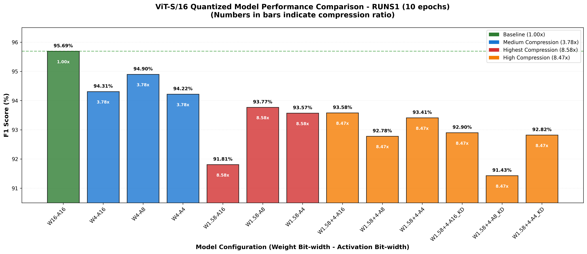
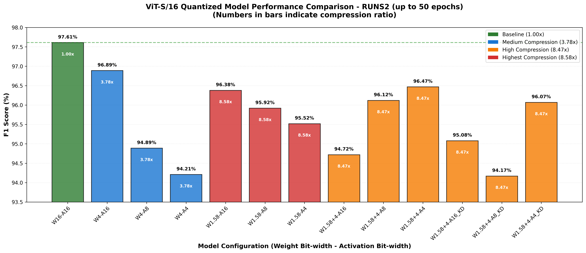

# Lightweight ViT on MNIST

This example demonstrates how to train a lightweight Vision Transformer (ViT) on MNIST dataset with EdgeRazor.

## Project Structure

```
example/qat/vit/
├── src/
│   ├── __init__.py                    # Package initialization
│   ├── __main__.py                    # Module entry point
│   ├── arg.py                         # Argument parser with all parameters
│   ├── train.py                       # Main training script with rich logging
│   ├── test.py                        # Main testing script with rich logging
│   └── ViT-S-16.json                  # ViT model configuration
├── q_vit_w1.58_a16.yaml               # QAT config: W1.58-A16
├── q_vit_w1.58_a8.yaml                # QAT config: W1.58-A8
├── q_vit_w1.58_a4.yaml                # QAT config: W1.58-A4
├── q_vit_w4_a16.yaml                  # QAT config: W4-A16
├── q_vit_w4_a8.yaml                   # QAT config: W4-A8
├── q_vit_w4_a4.yaml                   # QAT config: W4-A4
├── q_vit_w1.58mp4_a16.yaml            # QAT config: W1.58+4 mixed precision A16
├── q_vit_w1.58mp4_a8.yaml             # QAT config: W1.58+4 mixed precision A8
├── q_vit_w1.58mp4_a4.yaml             # QAT config: W1.58+4 mixed precision A4
├── q_vit_w1.58mp4_a16_kldr_fd.yaml    # QAT+KD config: W1.58+4-A16 with KLDR+FD
├── q_vit_w1.58mp4_a8_kldr_fd.yaml     # QAT+KD config: W1.58+4-A8 with KLDR+FD
├── q_vit_w1.58mp4_a4_kldr_fd.yaml     # QAT+KD config: W1.58+4-A4 with KLDR+FD
├── run.sh                             # Training commands (all configurations)
├── run1.sh                            # Training: 10 epochs, warmup=100
├── run2.sh                            # Training: 50 epochs, warmup=320, patience=4
├── test.sh                            # Test script for model evaluation
├── generate_table.py                  # Generate performance comparison tables
├── count_params.py                    # Count model parameters
├── inspect_layers.py                  # Inspect layer information
├── quant_prop.py                      # Calculate quantization proportion
└── README.md                          # Comprehensive documentation
```

## Model Configuration

**ViT-S/16** (Small variant with 16x16 patches):
- Hidden size: 384
- Layers: 12
- Attention heads: 6
- Image size: 224x224
- Patch size: 16x16
- Parameters: 21,817,354

## Quantization Configurations

### Weight Quantization
- **W1.58 (Ternary)**: {-1, 0, 1} * scaling_factor
  - Function: `weight_quant_uniform_symmetric_clip_per_channel_int1_58`
  - Granularity: Per-block
  
- **W4 (4-bit)**: {-7, ..., 0, ..., 7} * scaling_factor
  - Function: `weight_quant_uniform_symmetric_absmax_per_block_int4`
  - Granularity: Per-block

### State Quantization (Activation)
- **A16**: No quantization (full precision)
- **A8**: INT8 quantization using `state_quant_uniform_symmetric_absmax_per_token_int8`
- **A4**: INT4 quantization using `state_quant_uniform_symmetric_absmax_per_token_int4`

## Distillation Configurations

### Knowledge Distillation (KD)
Combines **QAT + KD** for training lightweight quantized models with teacher-student distillation:

- **Teacher Model**: Full-precision baseline (W16-A16)
- **Student Model**: Quantized model (W1.58+4 mixed precision)
- **Distillation Losses**:
  - **KLDR (KL Divergence Reverse)**: Logits-based distillation
    - Alpha: 0.01
    - Temperature: 2.0
    - Reduction: batch_mean
  - **FD (Feature Distillation)**: Hidden states distillation
    - Alpha: 0.01
    - Layer selection: ["low", "mid", "high"]
    - Reduction: batch_mean

### Mixed Precision Quantization (W1.58+4)
- **99% layers**: W1.58 (Ternary quantization)
- **1% layers**: W4 (4-bit quantization)
- **Selection**: Static configuration in YAML
- **Compression ratio**: ~8.47x (vs. 16-bit baseline)

### Configuration Files
- `q_vit_w1.58mp4_a16_kldr_fd.yaml`: W1.58+4-A16 with KD
- `q_vit_w1.58mp4_a8_kldr_fd.yaml`: W1.58+4-A8 with KD
- `q_vit_w1.58mp4_a4_kldr_fd.yaml`: W1.58+4-A4 with KD

## Usage

### Install Dependencies

```bash
# Install EdgeRazor package from the root directory
pip install -e ../../../

# Install project-specific dependencies
pip install -r requirements.txt
```

### Run Training

Execute all training configurations:

```bash
mkdir -p runs && bash run.sh | tee ./runs/$(date +%Y_%m_%d_%H_%M).log
```

This trains 7 models: Baseline (W16-A16), W1.58-A16, W1.58-A8, W1.58-A4, W4-A16, W4-A8, W4-A4

## Experimental Results

**Under same hyperparameters (batch_size=256, lr=1e-4, wd=0.2, warmup=100, epochs=10), performance:**

| Model    | Step | Training  | Distill      | Params | W      | A    | Prop   | Comp  | Accuracy | Recall | Precision | F1     |
| :------- | ---- | :-------- | ------------ | :----- | :----- | :--- | :----- | :---- | :------- | :----- | :-------- | :----- |
| ViT-S/16 | 10   | 3.054 min | $\times$     | ~21M   | 16     | 16   | 0%     | 1.00x | 95.72%   | 95.69% | 95.69%    | 95.69% |
| ViT-S/16 | 10   | 3.128 min | $\times$     | ~21M   | 4      | 16   | 98.02% | 3.78x | 94.37%   | 94.33% | 94.36%    | 94.31% |
| ViT-S/16 | 10   | 4.847 min | $\times$     | ~21M   | 4      | 8    | 98.02% | 3.78x | 94.96%   | 94.93% | 94.93%    | 94.90% |
| ViT-S/16 | 10   | 4.844 min | $\times$     | ~21M   | 4      | 4    | 98.02% | 3.78x | 94.28%   | 94.21% | 94.26%    | 94.22% |
| ViT-S/16 | 10   | 3.115 min | $\times$     | ~21M   | 1.58   | 16   | 98.02% | 8.58x | 91.91%   | 91.83% | 92.09%    | 91.81% |
| ViT-S/16 | 10   | 4.885 min | $\times$     | ~21M   | 1.58   | 8    | 98.02% | 8.58x | 93.84%   | 93.82% | 93.81%    | 93.77% |
| ViT-S/16 | 10   | 4.855 min | $\times$     | ~21M   | 1.58   | 4    | 98.02% | 8.58x | 93.64%   | 93.61% | 93.60%    | 93.57% |
| ViT-S/16 | 10   | 3.160 min | $\times$     | ~21M   | 1.58+4 | 16   | 98.02% | 8.47x | 93.65%   | 93.61% | 93.67%    | 93.58% |
| ViT-S/16 | 10   | 4.897 min | $\times$     | ~21M   | 1.58+4 | 8    | 98.02% | 8.47x | 92.83%   | 92.79% | 92.94%    | 92.78% |
| ViT-S/16 | 10   | 4.865 min | $\times$     | ~21M   | 1.58+4 | 4    | 98.02% | 8.47x | 93.47%   | 93.39% | 93.51%    | 93.41% |
| ViT-S/16 | 10   | 3.909 min | $\checkmark$ | ~21M   | 1.58+4 | 16   | 98.02% | 8.47x | 92.98%   | 92.97% | 92.98%    | 92.90% |
| ViT-S/16 | 10   | 5.685 min | $\checkmark$ | ~21M   | 1.58+4 | 8    | 98.02% | 8.47x | 91.58%   | 91.49% | 92.03%    | 91.43% |
| ViT-S/16 | 10   | 5.679 min | $\checkmark$ | ~21M   | 1.58+4 | 4    | 98.02% | 8.47x | 92.91%   | 92.85% | 92.87%    | 92.82% |

**Notes:**
- **Script**: `./run1.sh`
- **Params**: ~21M (21,817,354 parameters)
- **Prop**: Proportion of quantized parameters (98.02%)
- **Comp**: Compression ratio = 16 / ((1-Prop) * 16 + Prop * W_q)
  - W1.58+4 mixed precision: 16 / ((1-0.9802) * 16 + 0.9802 * 0.99 * 1.58 + 0.9802 * 0.01 * 4) = 8.47x
- **W**: Weight bit-width (1.58 = ternary, 1.58+4 = mixed precision)
- **A**: Activation (state) bit-width



**Under different hyperparameters (batch_size=256, lr=1e-4, wd=0.2, warmup=500, epochs=32, patience=4), best performance:**

| Model    | Step | Training  | Distill      | Params | W      | A    | Prop   | Comp  | Accuracy | Recall | Precision | F1     |
| :------- | ---- | :-------- | ------------ | :----- | :----- | :--- | :----- | :---- | :------- | :----- | :-------- | :----- |
| ViT-S/16 | 36   | 13.35 min | $\times$     | ~21M   | 16     | 16   | 0%     | 1.00x | 97.63%   | 97.61% | 97.62%    | 97.61% |
| ViT-S/16 | 32   | 12.05 min | $\times$     | ~21M   | 4      | 16   | 98.02% | 3.78x | 96.92%   | 96.88% | 96.93%    | 96.89% |
| ViT-S/16 | 9    | 6.50 min  | $\times$     | ~21M   | 4      | 8    | 98.02% | 3.78x | 94.94%   | 94.94% | 94.95%    | 94.89% |
| ViT-S/16 | 8    | 6.01 min  | $\times$     | ~21M   | 4      | 4    | 98.02% | 3.78x | 94.27%   | 94.21% | 94.27%    | 94.21% |
| ViT-S/16 | 39   | 14.90 min | $\times$     | ~21M   | 1.58   | 16   | 98.02% | 8.58x | 96.41%   | 96.41% | 96.37%    | 96.38% |
| ViT-S/16 | 39   | 22.68 min | $\times$     | ~21M   | 1.58   | 8    | 98.02% | 8.58x | 95.95%   | 95.88% | 96.04%    | 95.92% |
| ViT-S/16 | 24   | 14.59 min | $\times$     | ~21M   | 1.58   | 4    | 98.02% | 8.58x | 95.56%   | 95.55% | 95.57%    | 95.52% |
| ViT-S/16 | 34   | 12.88 min | $\times$     | ~21M   | 1.58+4 | 16   | 98.02% | 8.47x | 94.76%   | 94.75% | 94.94%    | 94.72% |
| ViT-S/16 | 34   | 20.04 min | $\times$     | ~21M   | 1.58+4 | 8    | 98.02% | 8.47x | 96.15%   | 96.10% | 96.19%    | 96.12% |
| ViT-S/16 | 31   | 18.48 min | $\times$     | ~21M   | 1.58+4 | 4    | 98.02% | 8.47x | 96.50%   | 96.48% | 96.46%    | 96.47% |
| ViT-S/16 | 25   | 12.21 min | $\checkmark$ | ~21M   | 1.58+4 | 16   | 98.02% | 8.47x | 95.12%   | 95.05% | 95.24%    | 95.08% |
| ViT-S/16 | 30   | 25.30 min | $\checkmark$ | ~21M   | 1.58+4 | 8    | 98.02% | 8.47x | 94.19%   | 94.10% | 94.43%    | 94.17% |
| ViT-S/16 | 37   | 20.92 min | $\checkmark$ | ~21M   | 1.58+4 | 4    | 98.02% | 8.47x | 96.10%   | 96.08% | 96.08%    | 96.07% |

- **Script**: `./run2.sh`
- **Comp**: W1.58+4 Compression ratio = 16 / ((1-Prop) * 16 + Prop * 0.99 * W_q_l + Prop * 0.01 * W_q_h)
  - e.g., 16 / ((1-0.9802) * 16 + 0.9802 * 0.99 * 1.58 + 0.9802 * 0.01 * 4) = 8.47x
  - e.g., 16 / ((1-0.9802) * 16 + 0.9802 * 0.90 * 1.58 + 0.9802 * 0.10 * 4) = 7.61x



## Changelog

- [x] ViT-S/16 full-precision baseline, W4-A16/8/4, W1.58-A16/8/4
- [x] ViT-S/16 mixed-precision 99% W1.58 + 1% W4
- [x] For quantized model, give more training budgets and compare results
- [x] Allow combining qat and kd modules to train lightweight ViT